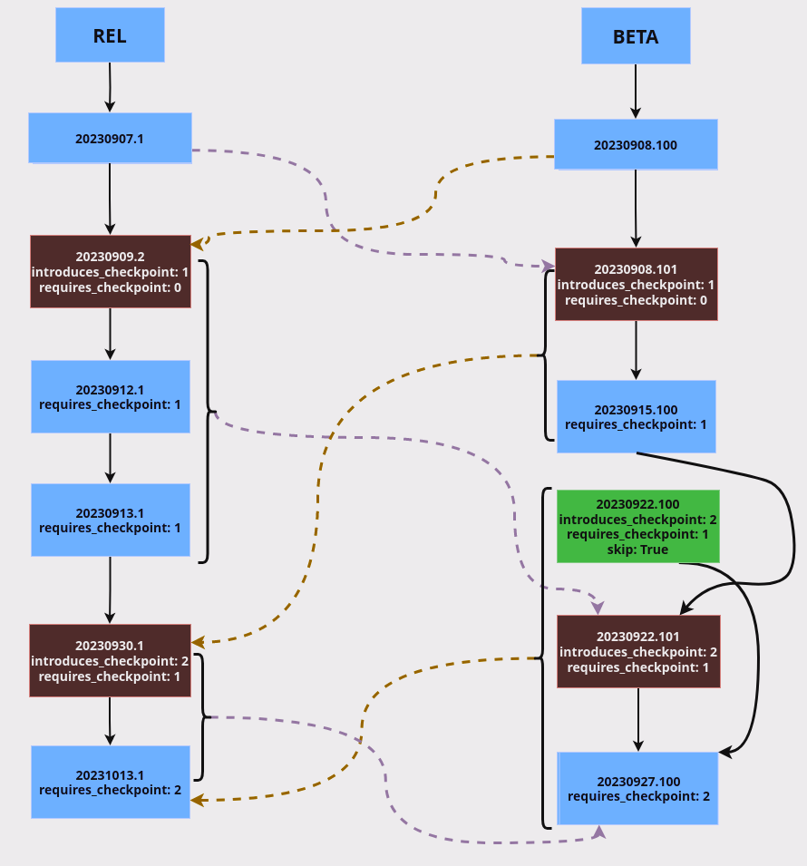
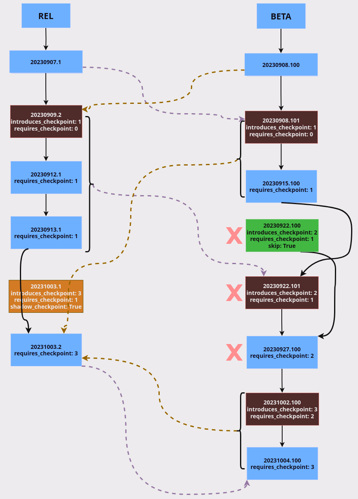

Overview
========

The image manifest
------------------

An *image manifest* describes an image. It's a JSON file, and it's created
during an image build, along other build artifacts. An image manifest is
installed within the image in `/usr/lib/steamos-atomupd/manifest.json`, and
it's also part of the build artifacts.

#### Mandatory fields

- product: `steamos`
- release: `holo`
- variant: `steamdeck`, `steamdeck-beta`
- arch: `amd64`
- version: `3.0`, `snapshot`
- buildid: `20190214.1`

The **version** must be a [semantic version](https://semver.org/), or must be
the special keyword `snapshot` for a snapshot.

The **buildid** must be an *ISO-8601 date* in the basic format, followed by an
optional `.` and a number called the *build increment*.

#### Optional fields

- introduces_checkpoint: an integer number
- requires_checkpoint: an integer number
- skip: `true` or `false`

If **introduces_checkpoint** is missing, it means this particular image doesn't
introduce any new checkpoint.
If **requires_checkpoint** is missing, it has the same meaning of
`requires_checkpoint: 0`. So, a client can install this image only if it never
passed any checkpoints before.

The **skip** option is used to signal an image that should not be taken into
consideration as a valid update candidate. Also, if a client is using an image
marked with **skip**, the server will always attempt to propose either an
upgrade, whether possible, or a downgrade.
This has the same meaning of completely deleting an image from the server.
The benefits are to keep track of the image's previous existence and to avoid
the potential issue of leaving behind leftover meta JSONs.

The **requires_checkpoint** field indicates that this image can be installed
only if the client is using an image that is past that particular checkpoint,
and not newer checkpoints. For example if a client is past a checkpoint 3, it
can't install an image that requires the checkpoint 2.

The **introduces_checkpoint** field, with a value greater than zero, indicates
that this image is a checkpoint. After installing this image, the clients will
be allowed to only install further updates that have a **requires_checkpoint**
that is equal to the value that the checkpoint introduced.

Checkpoints
-----------

Images that introduce new checkpoints, generally called simply "checkpoints",
are releases that can't be avoided. To give an example:

In this example we show the expected upgrade path from the available images.

Users are allowed to only install updates that have the same `requires_checkpoint`
as the image they are currently running. The only exception, and the only way to
increase that checkpoint number, is to install an image that introduces a new
checkpoint, aka a "checkpoint". As shown in the previous example, after you
install the image `20230909.2` that has `introduces_checkpoint: 1`, you'll be
allowed to install images that have a `requires_checkpoint: 1` instead of
`requires_checkpoint: 0`.

At the moment, for a particular `introduces_checkpoint: X`, it is allowed to
have at most one "canonical" checkpoint image and one shadow checkpoint.
Instead, for checkpoints flagged as `skip`, there is no limit.

Shadow checkpoints
------------------

Shadow checkpoints are not real images and the server will never propose them
as valid update candidates.

In this regard they are similar to "skip" images but with a key difference. Even
if they are not proposed as candidates, they still increase the checkpoint number
as if the client actually passed that checkpoint.

They are used to flag that two particular checkpoints are compatible with each other.

This is easier to understand with an example:

In this example we have `20231003.1` that has been released as a shadow checkpoint.
This allows `20230913.1` to directly install the canonical image `20231003.2`, even
if it has a different `requires_checkpoint`.

The main use case for shadow checkpoints is when there are two checkpoints that
essentially cancel each other. E.g. we introduce checkpoint 2, but then we realize
that its breaking changes are not needed anymore, or they are simply wrong, so we
introduce another checkpoint 3 that basically reverts all the previous breaking changes.

Shadow checkpoints allow us to signal that a checkpoint 1 is compatible with the
checkpoint 3 and that we don't actually need to install any checkpoint to perform
the transition.

Shadow checkpoints can't be flagged as `skip`. If you released a shadow checkpoint
and then, later on, you desire to delete it, you need to remove, rename or move
the image manifest.

Client and server
-----------------

Please look at `client.md` and `server.md` for details.

FAQ
---

### What's the relation between checkpoints in different variants?

Checkpoints are synchronization points that are valid across variants.

E.g. this means that the breaking changes provided by an image `introduces_checkpoint: 1`
in Main, must be the same as the equivalent `introduces_checkpoint: 1` in Beta.

### We need to release our first checkpoint, what should we do?

Release an image, preferably in `main` or `staging`, that has
`introduces_checkpoint: 1` and `requires_checkpoint: 0`.

"Requires checkpoint" is where you are now, and "introduces checkpoint" is where
you are going.

After you ensure the checkpoint is working correctly, release similar checkpoint
images in all the other variants. I.e. images that introduce the same checkpoint 1
and make the same breaking change.

All the subsequent regular images that expect the clients to be past that checkpoint
must have the flag `requires_checkpoint: 1`.

### I'm using an image that has `requires_checkpoint: 1`, can I install a checkpoint that has `introduces_checkpoint: 1` and `requires_checkpoint: 0`?

No, your image is already past that checkpoint. This means that you can't install
it again. This is signaled by the fact that the checkpoint requires a base image with
checkpoint 0, but yours is at checkpoint 1.
After you are past a checkpoint, you can't go back.

### We released a checkpoint but is buggy, can we delete it?

You can use the canonical `skip: True` flag to mark an image as being "retired".
The server will simply skip over it, as if you literally deleted the checkpoint.

However, please keep in mind that if there are users that already installed that
checkpoint, they'll be able to only install other images that have the new
`requires_checkpoint`. This means that if you retire a checkpoint, without releasing
something to substitute it, some users might find themselves stuck without any
possibility to install other updates.

For this reason it is highly advised to release a corrected checkpoint image
that substitutes the retired one ASAP.

An example of this is shown in the diagram above, for the images `20230922.100`
and `20230922.101`.

### In Main we released two checkpoints in close proximity, do we have to release two checkpoints for all the other variants too?

No, if the breaking changes of these two checkpoints can be combined into a single
image.

For example if you have in Main:
- `20231102.1000`, `introduces_checkpoint: 1`, `requires_checkpoint: 0`
- `20231103.1000`, `introduces_checkpoint: 2`, `requires_checkpoint: 1`

You are allowed to create in stable a checkpoint that jumps directly to the checkpoint 2:
- `20231104.1`, `introduces_checkpoint: 2`, `requires_checkpoint: 0`

### We released a checkpoint, but then we realized that the breaking changes were not needed. Can we go back to the previous checkpoint number?

No, checkpoint numbers can only increase.

If you want to revert the breaking changes that you made you have to release a new
checkpoint that essentially reverts everything to what you had before that checkpoint.

However, in all the other variants you might be able to create shadow checkpoints instead.

E.g. if you want to revert checkpoint 2, you need to release an image that has
`introduces_checkpoint: 3` and `requires_checkpoint: 2`.
But in the other variants (unless there you already released the checkpoint 2 too),
you can create a shadow checkpoint with `introduces_checkpoint: 3` and `requires_checkpoint: 1`.
This will allow the server to consider the checkpoint 1 and 3 as being compatible.
